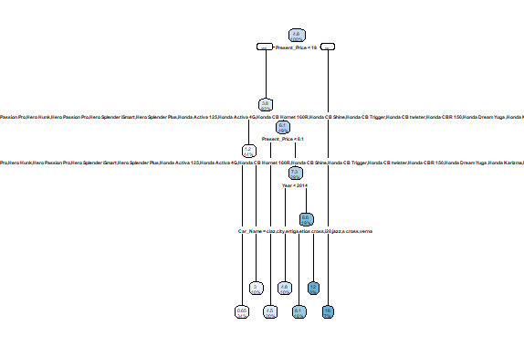

# Analisis Harga Jual Mobil Bekas

## Latar Belakang Masalah 
Analisis harga jual mobil bekas penting dilakukan untuk memahami faktor-faktor yang memengaruhi penetapan harganya. Pemahaman ini berguna bagi dealer maupun konsumen dalam transaksi jual beli mobil bekas. Selain itu, hasil analisis juga bermanfaat bagi perusahaan pembiayaan dalam menentukan kelayakan kredit pembelian mobil bekas.

## Pemahaman Bisnis
Tujuan analisis adalah membangun model prediksi harga jual mobil bekas di India berdasarkan karakteristiknya, seperti merk, tahun pembuatan, jarak tempuh, dll. Model prediksi ini nantinya berguna untuk:
- Membantu dealer menetapkan harga jual dan harga beli mobil bekas
- Membantu konsumen menilai apakah harga mobil yang ditawarkan wajar
- Menjadi salah satu pertimbangan penentuan kelayakan kredit pembelian mobil bekas bagi perusahaan fintech/pembiayaan.

## Pemahaman Data
Dataset berisi 992 observasi mobil bekas di India dengan 9 variabel numerik dan kategorik: merk, tahun pembuatan, harga jual, harga saat ini, jarak tempuh, jenis bahan bakar, tipe penjual, transmisi, dan jumlah pemilik sebelumnya.

Beberapa catatan:
- Sumber dan metode pengumpulan data aslinya tidak diketahui
- Perlu validasi apakah distribusi data sudah mewakili populasi mobil bekas di India
- Perlu analisis lebih lanjut apakah terdapat data bias tertentu

## Persiapan Data
Beberapa pemprosesan data yang dilakukan:
- Pengisian missing value pada variabel harga saat ini dengan nilai rata-rata
- Menghapus observasi yang masih memiliki missing value  
- Pembagian data latih (80%) dan data uji (20%) secara acak
- Penyesuaian factor level pada data uji agar sesuai dengan data latih

## Pemodelan
- Decision tree CART digunakan untuk memprediksi harga jual berdasarkan variabel numerik & kategorik lainnya
- Dilakukan pruning model menggunakan parameter kompleksitas untuk menghindari overfitting
- Visualisasi model dilakukan untuk memudahkan interpretasi aturan dan faktor penentu harga jual

## Evaluasi Model
- Metrik evaluasi: Root Mean Squared Error (RMSE) pada data uji
- Model decision tree mencapai RMSE 1,766
- Semakin kecil nilai RMSE mengindikasikan performa model semakin baik

## Rekomendasi
Beberapa rekomendasi untuk pengembangan lebih lanjut:
- Lakukan feature engineering untuk meningkatkan akurasi prediksi 
- Uji coba algoritma pemodelan lainnya: Random Forest, XGBoost
- Implementasikan model prediksi pada applikasi atau platform jual-beli mobil bekas.

## Script Yang Dipakai Untuk Analisis Harga Jual Mobil Bekas

**Source Code**
   ```R
# Baca dataset
dataset <- read.csv("D:/data mining/car data.csv")

# Replace missing value dengan rata-rata
dataset[is.na(dataset)] <- lapply(dataset, function(x) ifelse(is.numeric(x), mean(x, na.rm = TRUE), NA))

# Hapus baris dengan NA
dataset <- na.omit(dataset) 

# Bagi dataset menjadi data train dan test 
set.seed(100)
split <- caTools::sample.split(dataset$Selling_Price, SplitRatio = 0.8)
train <- subset(dataset, split == TRUE)
test <- subset(dataset, split == FALSE)

# Install dan muat paket caTools jika belum diinstal
if (!requireNamespace("caTools", quietly = TRUE)) {
  install.packages("caTools")
}
library(caTools)

# Install dan muat paket rpart jika belum diinstal
if (!requireNamespace("rpart", quietly = TRUE)) {
  install.packages("rpart")
}
library(rpart)

# Decision tree model
model <- rpart(Selling_Price ~ ., data = train, 
               control = rpart.control(minsplit = 20, minbucket = 7, cp = 0.01))

# Install dan muat paket rpart.plot jika belum diinstal
if (!requireNamespace("rpart.plot", quietly = TRUE)) {
  install.packages("rpart.plot")
}
library(rpart.plot)

# Plot pohon keputusan
rpart.plot(model)

# Periksa level unik di data pelatihan
levels_train <- levels(train$Car_Name)

# Periksa level unik di data uji
levels_test <- levels(test$Car_Name)

# Periksa level yang tidak muncul di data pelatihan
new_levels_test <- levels_test[!(levels_test %in% levels_train)]

# Ganti level yang tidak ada di data pelatihan dengan level yang ada
test$Car_Name <- factor(test$Car_Name, levels = levels_train)

# Lakukan prediksi setelah menangani faktor "Car_Name"
pred <- predict(model, test)
rmse <- sqrt(mean((test$Selling_Price - pred)^2))
print(rmse)
```

## Gambar Hasil Proyek Harga Jual Mobil Bekas 


